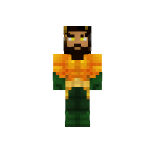
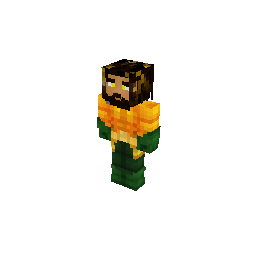
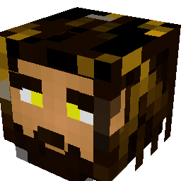
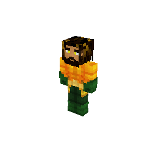
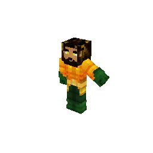

# bedrock-skin

**Render Minecraft Bedrock skins to PNG and GIF, in TypeScript, in the browser or on a server.** 3D bodies, heads and avatars, capes, slim and wide arms, custom geometry, persona skins, armor, elytra and held tools, animations from Blockbench files, and a detector for invisible skins.

<p align="center">
  
  
  
  
  
</p>

Texture in, image out. No GPU, no canvas, no WebGL, no native modules: a small software rasterizer in plain TypeScript, with one small dependency (fflate, for PNG compression). It reads skins the way a Bedrock (MCPE) client sends them, so it drops straight into a proxy, a server, a Discord bot or a web page.

```bash
npm install bedrock-skin
```

It is the TypeScript version of [bedrock-skin-go](https://github.com/THEBOSS9345/bedrock-skin-go) (and of [bedrock-skin-rs](https://github.com/THEBOSS9345/bedrock-skin-rs)), and it renders **the same images, pixel for pixel** - the tests check every render, animation frame, pose and report against the Go library's output.

It works from ES modules and CommonJS alike, with types for both:

```js
import { renderPNG } from 'bedrock-skin'           // ESM, TypeScript, bundlers
const { renderPNG } = require('bedrock-skin')      // CommonJS
```

## Quick start

```ts
import { readFileSync, writeFileSync } from 'node:fs'
import { decodeImage, renderPNG } from 'bedrock-skin'

const texture = decodeImage(readFileSync('skin.png'))

// A full body, straight on, 512x512.
writeFileSync('body.png', renderPNG({ texture }))

// A 256px head icon from an angle.
writeFileSync('avatar.png', renderPNG({ texture, view: 'avatar', angle: 'iso', size: 256 }))
```

`render` gives the pixels instead of a PNG: `{ width, height, data }`, RGBA, the same shape as the browser's `ImageData`, so it goes straight onto a canvas:

```ts
const img = render({ texture, view: 'avatar', size: 128 })
ctx.putImageData(new ImageData(new Uint8ClampedArray(img.data), img.width, img.height), 0, 0)
```

Skins coming off the wire arrive as raw RGBA rather than an encoded image; `textureFromRGBA` wraps those. Holding encoded files and wanting a file back? `renderBytes` takes every image as PNG bytes and the geometry as raw JSON, and returns a PNG.

Textures are PNGs, as skins are. A JPEG is refused rather than decoded differently from the Go version: decode it yourself (`createImageBitmap` in a browser, `sharp` in Node) and pass the pixels.

## Geometry is optional, and that matters

A Bedrock client sends **no mesh at all** for a skin that uses one of the built-in models: its login packet carries the literal JSON `null`, and names the model only in the skin's resource patch. So leaving `geometry` out is not a shortcut - for most real skins it is the correct input, and the vanilla humanoid stands in.

When a skin does carry geometry, parse it, and pick the entry its resource patch names:

```ts
const img = render({
  texture,
  geometry: parseGeometry(geometryJson),
  identifier: parseResourcePatch(resourcePatchJson).default, // e.g. "geometry.humanoid.customSlim"
})
```

`parseGeometry` reads both of Bedrock's formats, the modern `minecraft:geometry` array and the pre-1.12 one. Take wide vs slim from the resource patch, not the login packet's `ArmSize`: real captures show the two disagreeing.

## Options

| Field | Meaning |
| --- | --- |
| `texture` | The skin image. The only required field. |
| `geometry` | From `parseGeometry`. Left out uses `defaultGeometry()`. |
| `identifier` | Which entry to render. Left out picks the one with the most cubes. |
| `cape` | A cape texture, drawn from the geometry's `cape` bone or the built-in one. Not drawn for head and avatar views. |
| `view` | `'body'`, `'chest'`, `'head'` or `'avatar'`. |
| `angle` | `'front'` or `'iso'`; left out is the view's default. |
| `parts` | Exact bone names, e.g. `['head', 'leftArm']`. Overrides `view`. |
| `camera` | Explicit `yaw`, `pitch`, `fov` and `margin`. Overrides `angle`. |
| `size` | Output edge length; left out means 512. Always square. |
| `pose` | Moves bones, e.g. one frame of an animation. |
| `animated` | A persona skin's animation images, which texture its face. |
| `armor` | Armor and elytra worn over the skin, one texture per piece. `armorSet(layer1, layer2)` for a full set. |
| `rightHand`, `leftHand` | An item held in each hand, placed as the game places it, with an optional `adjust` to move, turn or resize it. |
| `scale` | The figure's size in the image (`model`) and per-bone scales (`parts`). |
| `hideSkin` | Draws the equipment alone, without the skin; no texture needed. |

Bones are picked by ancestry, so naming `head` also brings a hat, hair, ears or horns parented under it. Custom skins work with no special-casing.

`parseView`, `parseAngle` and `parseParts` turn request parameters into options, and **reject** names they don't know, so a request for `avatr` is an error rather than a full-body render.

## Armor, elytra and held items

Dress the skin in armor or an elytra and put an item in either hand. The textures come from a resource pack, as the game lays them out:

```ts
const img = render({
  texture,
  armor: armorSet(diamond1, diamond2),          // diamond_1.png, diamond_2.png
  rightHand: { item: diamondSword },            // diamond_sword.png
  leftHand: { item: bread, flat: true },
})
```

Pieces mix freely, and equipment moves with every animation. `renderItem` draws an item by itself, and `renderItemGIF` spins it. See [docs/equipment.md](https://github.com/THEBOSS9345/bedrock-skin-go/blob/main/docs/equipment.md).

## Animation

Minecraft's own player motions are built in (`Motion.walk`, `idle`, `wave`, `sneak`), and `parseAnimations` reads any Bedrock animation file - what Blockbench exports - with keyframes, smooth interpolation and Molang expressions.

```ts
import { Motion, parseAnimations, renderFrames, renderGIF } from 'bedrock-skin'

const gif = renderGIF({ texture, size: 256, animation: Motion.walk })

const anims = parseAnimations(blockbenchExport)
const frames = renderFrames({ texture, animation: anims.get('animation.player.wave')! })
```

33 example animations come bundled - dances, emotes, a backflip, fighting moves - as `exampleAnimations()`. Not every Minecraft animation plays on every model: an animation moves bones by name, so one made for a mob with wings does nothing on a player. `animation.missingBones(geometry)` tells you.

A viewer that turns the model while it plays does not want the whole GIF at once: `prepareFrames` builds the frames and their shared camera without drawing, then `frames.draw(i, size, camera)` rasterizes one frame at the viewer's own camera as it moves - about a millisecond for a 256px frame. See [docs/animation.md](https://github.com/THEBOSS9345/bedrock-skin-go/blob/main/docs/animation.md#drawing-frames-as-a-camera-moves).

## Skins straight from a packet

A proxy or bot holds a skin the way the client sent it: raw RGBA, `null` geometry for a built-in model, a resource patch naming the model, and - for a persona skin - animation images carrying its face. `decodeWireSkin` takes those fields as they are, the right model picked and the face attached:

```ts
const skin = decodeWireSkin({
  skinData: packet.skinData,
  skinWidth: packet.skinWidth,
  skinHeight: packet.skinHeight,
  geometry: packet.geometry,
  resourcePatch: packet.resourcePatch,
})
const png = renderPNG({ ...skinOptions(skin), view: 'avatar' })
```

`wireSkinDetector` gives the invisibility detector the same fields.

## Reading geometry files

`parseGeometryTree` keeps a whole geometry file and picks any value out of it by path:

```ts
const tree = parseGeometryTree(raw)
tree.get('geometry.humanoid.custom/bones/rightArm/pivot')?.asNumbers() // [-5, 22, 0]
tree.select('*/bones/*/cubes/*/size')                                  // every cube's size
```

## Persona skins

Persona (character creator) skins are built from poly meshes instead of cubes, and render in 3D like any other model. Their parts are spread over several geometry entries, and the head is textured by the skin's face animation rather than the skin image - add the animation images to draw it:

```ts
const img = render({ texture, geometry, animated: [{ type: ANIMATED_FACE, texture: face }] })
```

Without them the body renders and the head view throws a `SkinError` with code `EMPTY_VIEW`.

## Detecting invisible skins

The same inputs feed a detector for the "invisible player" trick:

```ts
import { Skin } from 'bedrock-skin'

const skin = new Skin(texture, geometryJson)
switch (skin.report().verdict) {
  case 'invisible': // nothing renders, or only a stray limb
  case 'suspicious': // some body parts missing - worth a look
}
```

The report has a verdict, how many of the six standard parts render, and a per-part breakdown, and `JSON.stringify` gives the same shape as the Go version's. With geometry, it checks the texture where the cubes actually map, so transparent regions and too-tiny bones are caught; a cape never masks an invisible body; persona skins are trusted. `new Skin(texture, geometry, options)` sets the thresholds.

## Errors

Every function throws a `SkinError` for bad input, with a `code` saying which kind - `NO_TEXTURE`, `JSON`, `GEOMETRY`, `IMAGE`, `UNKNOWN_VIEW` and so on - so a server can tell bad input from a bug without matching message text:

```ts
try {
  renderBytes({ texture: upload })
} catch (e) {
  if (e instanceof SkinError) return reply(400, e.message)
  throw e
}
```

## Untrusted input

The library sets no limits of its own - what is too large is your policy. For arbitrary uploads:

- Check `imageDimensions` before decoding: it reads only the header, and a few-KB PNG can declare enormous dimensions.
- Check `complexity` (bones and cubes) before rendering a geometry document.
- Bound how many renders run at once. Each is synchronous CPU work; on a busy server, run them in worker threads.

## Documentation

[bedrock-skin-go's `docs/`](https://github.com/THEBOSS9345/bedrock-skin-go/tree/main/docs) explains how Bedrock skins work and how the libraries draw them: [what a client sends](https://github.com/THEBOSS9345/bedrock-skin-go/blob/main/docs/skin-data.md), [the geometry format](https://github.com/THEBOSS9345/bedrock-skin-go/blob/main/docs/geometry-format.md), [the rendering pipeline](https://github.com/THEBOSS9345/bedrock-skin-go/blob/main/docs/rendering-pipeline.md), [animation](https://github.com/THEBOSS9345/bedrock-skin-go/blob/main/docs/animation.md) and [why it works the way it does](https://github.com/THEBOSS9345/bedrock-skin-go/blob/main/docs/design-decisions.md). The names differ only by language: `RenderOptions.Texture` there is `texture` here.

## Contributing

Pull requests welcome, and so is using AI to write them - point it at [AGENTS.md](AGENTS.md) first.

This package and the Go version are kept identical. A change to how something renders goes into both, and `tools/parity` (a small Go program) regenerates the reference output the tests compare against. Run `npm run check` before opening a PR. See [CONTRIBUTING.md](CONTRIBUTING.md).

## License

[The Unlicense](LICENSE) - public domain. The bundled `default_geometry.json` is Mojang's vanilla humanoid model, captured from a real client, included for interoperability. The pictures above are rendered by this package from `testdata/bench-skin` (`node tools/images.mjs`).
